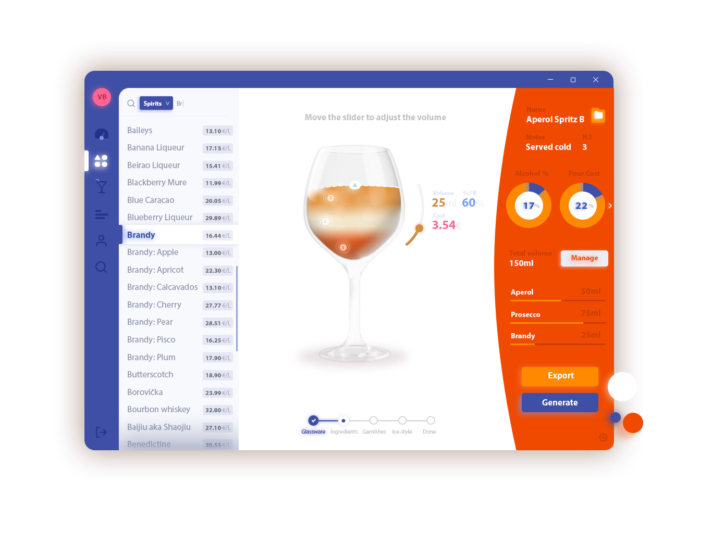
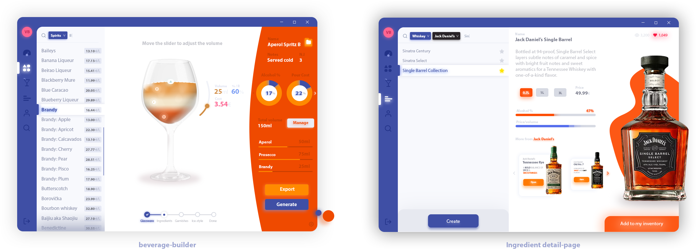

# Drinkle
> Comprehensive recipe-development Java toolkit that streamlines the beverage development
process under one unified, visually stunning, collaboration-oriented platform. 

    

## Table of contents
- [Description](#description)
- [Features](#features)
- [License](#license)

# Description

**Drinkle** is comprehensive _recipe-development toolkit_ that streamlines the beverage development
process, integrating each and every development procedure, from the ingredient design to the BOM
generation, under one _unified_, visually stunning, _collaboration-oriented_ platform. Since recipe
development plays an essential role in brand identity the main application’s target are small, mediumsized companies that, within the same software, with a centralized approach, can easily manage their
employees and recipes, granting _custom permissions_ and assigning _ad-hoc roles_ per recipe. With
businesses in mind, bill of materials, recipe guidelines and menus can also be, with ease of use, exported
within the same platform. In view of the fact that creating, recording and sharing recipes, at the time of
this paper, represents a tedious process due to a lack of standardized norms and tools in the prosumer
market sector, the software integrates a version for privates with limited functionalities that allows to
visually design and share cocktail recipes in a structured easy-to-read manner.

# Features

- [ ] Custom ingredient creation
- [ ] Customizable per-ingredient price

# Views

    

## License

[MIT](http://opensource.org/licenses/MIT)
